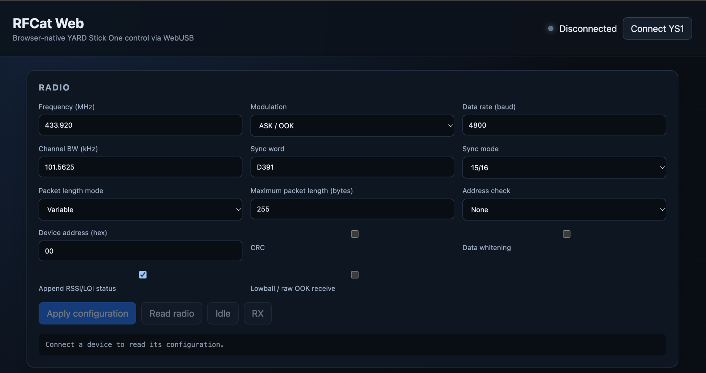
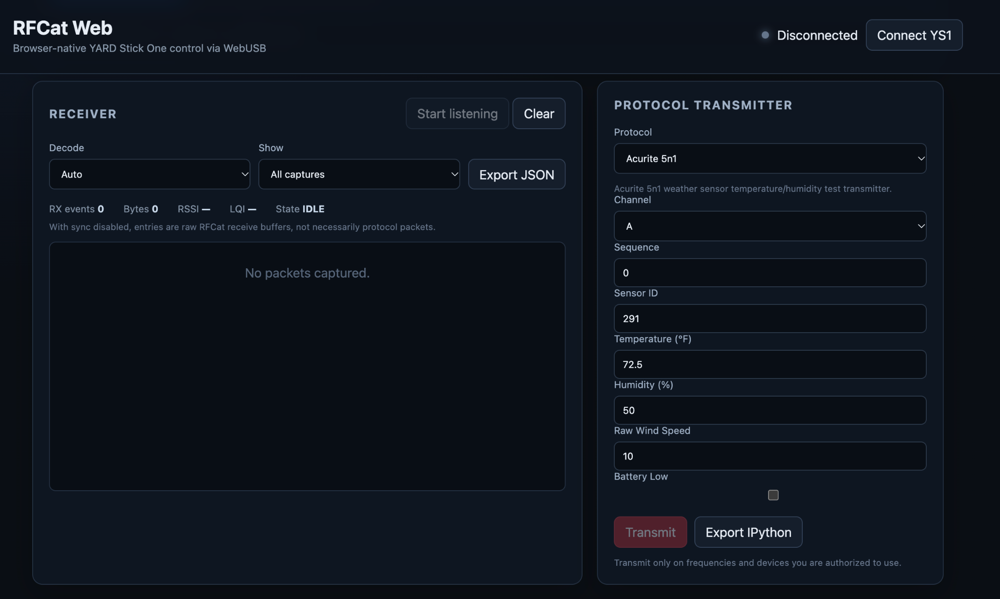
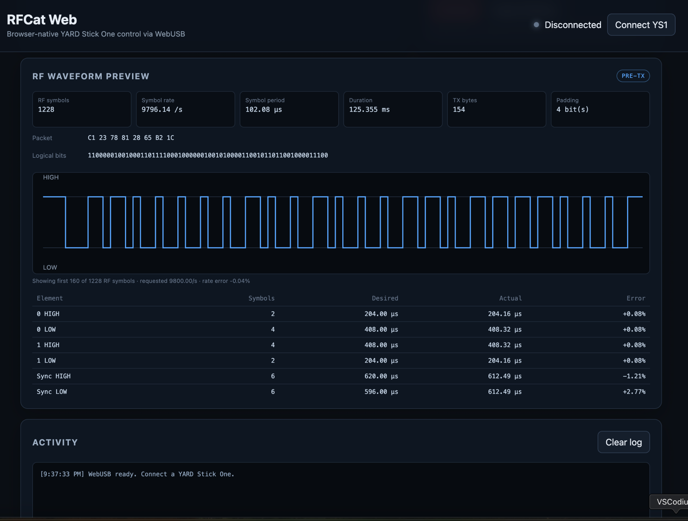

# RFCat Web

Browser-based WebUSB controller for RFCat-compatible CC1111 hardware such as the YARD Stick One.

RFCat Web provides direct radio configuration, receive/transmit controls, protocol-aware decoding, waveform inspection, IPython export, and a modular protocol system that keeps protocol-specific encoding and RF configuration out of the main application.

## Screenshots

### Radio configuration

Configure the CC1111 radio directly from the browser.



### Receiver and protocol transmitter

Receive raw or decoded RF traffic and transmit supported protocols.



### RF waveform preview

Inspect encoded RF symbols, packet data, symbol timing, and the generated waveform before transmission.



## Features

RFCat Web currently supports:

- Direct WebUSB communication with RFCat-compatible CC1111 devices
- Radio configuration and register inspection
- Packet receive and transmit
- Raw, Auto, and protocol-specific RX decoding
- Protocol-specific transmit configuration
- IPython / RFCat command export
- CC1111 RSSI, LQI, CRC, and MARCSTATE inspection
- Lowball/raw OOK receive configuration
- JSON RX capture export
- Modular protocol encoders and decoders
- Direct/non-packet transmit operations
- Bounded continuous-carrier RF testing
- Browser operation without a build system or bundler

## Protocols

Implemented protocol modules include CAME-12, Binary, LRS, Tesla charge-port test signaling, generic OOK/PWM, Oregon THGR122NX, Acurite 5n1, several Schrader TPMS formats, and TouchTunes / The Fonz.

### Validation status

Protocol implementations have different validation levels. A synthetic validation means generated samples were checked against the expected decoder or source algorithm. OTA waveform validation additionally means a YARD Stick One transmission was independently captured and its timing/framing compared with the expected waveform.

TouchTunes / The Fonz is **OTA waveform validated**. A YARD Stick One transmission captured with an RTL-SDR matched the expected preamble, 32-bit frame structure, variable-length OOK encoding, and approximately 566 µs base timing. Receiver interoperability with an actual TouchTunes jukebox has not been validated.

## Receiver and decoders

The receiver supports **Raw**, **Auto**, and protocol-specific decode modes. Protocol modules can opt into RX by implementing a `decode(bytes, context)` hook. Unknown traffic remains available as raw captures, and CC1111 appended RSSI/LQI status bytes are separated from the protocol payload before decoding.

CAME-12 is the first protocol with an RX decoder. It has been validated over the air between two YARD Stick One devices using compatible CC1111 packet framing. The current receiver is packet-engine based, so physical asynchronous OOK remotes may require a future pulse-oriented receive path rather than the same packet boundaries used by RFCat-generated transmissions.

See [Receiver and Protocol Decoders](docs/receiver-decoders.md) for RX behavior, decoder development, framing notes, and the known-good CAME test setup.

See [docs/README.md](docs/README.md) for protocol documentation.

## Architecture

Protocol implementations live under `js/protocols/`. Each protocol declares its own metadata, UI fields, encoder, radio configuration, and transmit behavior. `app.js` remains protocol-agnostic and the WebUSB/RFCat device layer remains hardware-focused.

Browser ES modules use explicit relative imports with `.js` extensions. The protocol registry is maintained explicitly in `js/protocols/index.js`, which keeps the project compatible with GitHub Pages without requiring a bundler.

## Running locally

Serve the repository from a local HTTP server:

```bash
python3 -m http.server 8080
```

Then open the local server in a WebUSB-capable browser.

## Testing

Run the JavaScript test suite with the project's npm test command.

Synthetic RF generators under `tools/` can create sample files for independent waveform/decoder analysis. Generated captures should be written under `tmp/`, which is excluded from version control.

## Safety and authorization

Transmit only on frequencies and equipment you are legally permitted to use. Protocol support is intended for development, interoperability testing, research, and equipment you own or are explicitly authorized to test.

## OOK Pulse Analyzer

The receiver includes an OOK Pulse Analyzer for inspecting HIGH/LOW timing runs from raw RFCat receive buffers. It uses the configured data rate as the sampling clock, draws a timing waveform, clusters similar pulse widths, estimates a base pulse, and can export the captured runs and timing distribution as JSON.

For asynchronous OOK exploration, disable sync and enable **Lowball / raw OOK receive** before listening. The analyzer currently derives pulse timing from received CC1111 sample bytes; it is not a firmware-level edge timestamp capture, so timing resolution is limited by the configured data rate.
